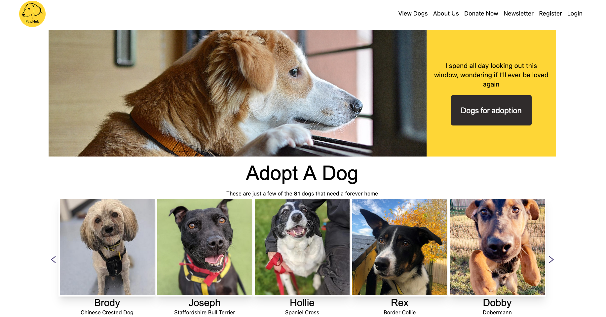
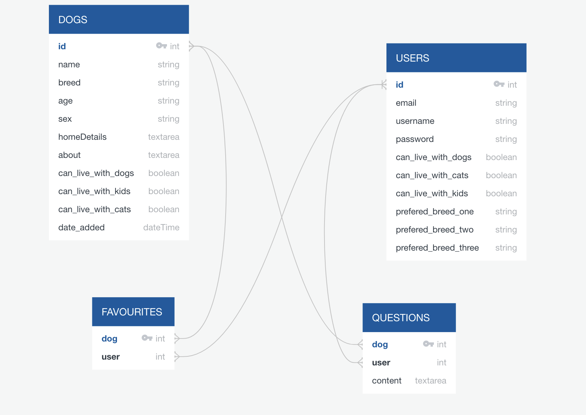
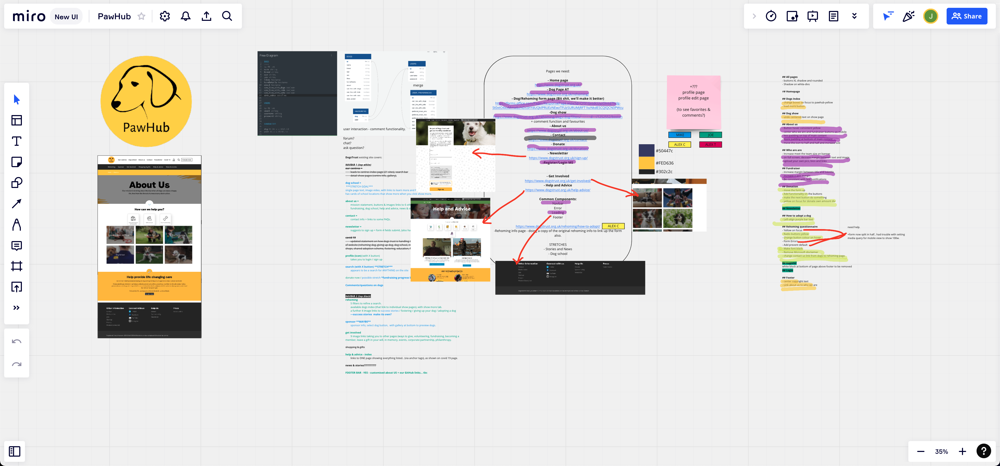
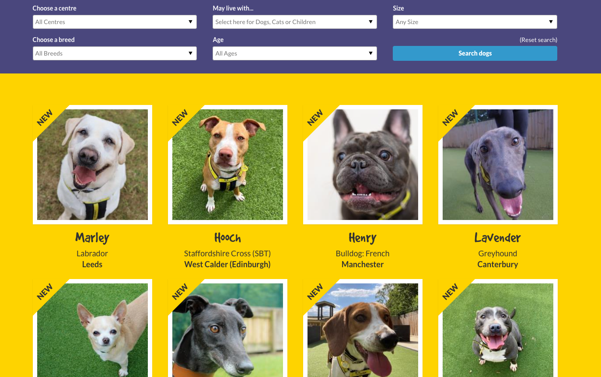
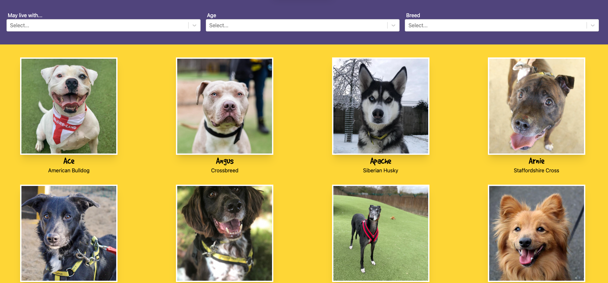
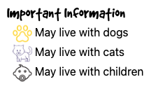
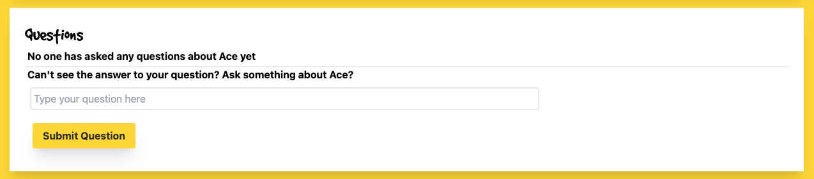
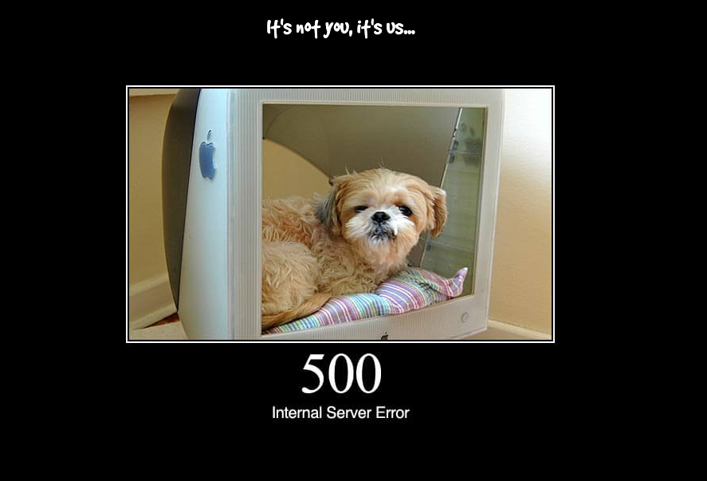
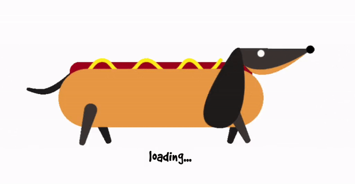

# Project 3 - PawHub
## Overview
PawHub was the fourth and final project of the General Assembly Software Engineering Immersive Course. This was a full-stack, group project done in a group of 4 over a week. As a group, we decided to build a dog rehoming app based off the [Dog's Trust](https://www.dogstrust.org.uk/) website.

## Brief
* Build a full-stack application - by making your own backend and your own frontend
* Use a Python Django API using Django REST Framework to serve your data from an SQL database
* Consume your API with a separate frontend built with React
* Be a complete product which most likely means multiple relationships and CRUD functionality for at least a couple of models
* Implement thoughtful user stories/wireframes that are significant enough to help you know which features are core MVP and which you can cut
* Have a visually impressive design
* Be deployed online so it's publicly accessible

## Collaborators
* [Alex Chan](https://github.com/achan81)
* [Joe Freeman](https://github.com/joefreeman8)
* [Mike Salter](https://github.com/msalter91)

## Built With
* HTML
* CSS
* Tailwind
* JavaScript
* React.js
* Python
* Django
* Axios
* Git
* GitHub
* Canva

## Deployed Version
[View the deployed version of the app](https://paw-hub.netlify.app/)



## Planning
For this project we were given the opportunity to choose if we wanted to work in teams or solo. The four of us got on really well during the course and hadn't worked together before, so we decided to work together for our final project. From the very initial conversation, we all set out what we personally wanted to achieve from our final project. We all agreed that our main goal was to create a smooth, slick and polished app that was mobile compatible. We also wanted to do a website clone as none of us had cloned anything for a previous project. Not only would this be a great time saver as it takes away having to design the look of a website, but also it shows that we can built an app according to a client's desires.

After some discussion of things we have in common, it was quite obvious that we all shared a passion for dogs and finding homes for them. We had a look at a few dog rehoming websites and Dog's Trust was the one that appealed to us the most, due to it's fun colours and layout. From there on, we set up to build a better version of their website.

We knew we wanted to use a CSS framework that none of us had used before as a learning experience and after some research we decided Tailwind would be the one due to it's current popularity in the industry. We each spent some time familiarising ourselves with Tailwind's features and components to be more prepared when it came to the frontend.

We started by creating an ERD diagram to plan the backend models and establish the relationships between them. We wanted to push ourselves and our SQL database abilities by creating many-to-many relationships:



We then created a virtual whiteboard using Miro which enabled us to share notes, create to-do lists and plan our days as a group:



### Work Split
As we were a group of 4 for the first time, it was important to us for the work to be split evenly across both backend and frontend. During the project we worked while on a Zoom call and shared code snippets on Slack in order to work as collaboratively as possible.
## Backend
When it came to the backend we were aiming to get it done as soon as possible so we could crack on with the frontend and make our project as aesthetically pleasing as possible. We took turns coding while sharing our screen and this allowed each of us to code review as we went along. As using Django on a project was new to all of us it was critical to have the eyes and support of our teammates at this stage. Once each person was done, we would merge our branch and push it into the development branch for the next person to pull the most up to date code.

We created two apps, one for the dogs and one for user authorisations. We were able to use generics built into Django for a lot of this which enabled us to work quickly to finish the backend. We used some custom code for the user login:
```py
class UserLoginView(APIView):
   ''' View for Users Login /login POST'''
 
   def post(self, request):
       username = request.data.get('username')
       password = request.data.get('password')
 
       try:
           user_to_login = User.objects.get(username=username)
       except User.DoesNotExist:
           raise PermissionDenied({'detail':'Unauthorized'})
 
       if not user_to_login.check_password(password):
           raise PermissionDenied({'detail':'Unauthorized'})
 
       expiry_time = datetime.now() + timedelta(days=7)
 
       token = jwt.encode(
           {'sub': user_to_login.id, 'exp': int(expiry_time.strftime('%s'))},
           settings.SECRET_KEY,
           algorithm='HS256'
       )
 
       return Response({
           'token': token,
           'message': f'Welcome back {user_to_login.username}'
       })
```
For authorisation, we decided to use JWT:
```py
class JWTAuthentication(BasicAuthentication):
 
   def authenticate(self, request):
       header = request.headers.get('Authorization')
 
       if not header:
           return None
 
       if not header.startswith('Bearer'):
           raise PermissionDenied({'detail':'Invalid Auth Header'})
 
       token = header.replace('Bearer ', '')
 
       try:
           payload = jwt.decode(token, settings.SECRET_KEY, algorithms=['HS256'])
           user = User.objects.get(pk=payload.get('sub'))
       except jwt.exceptions.InvalidTokenError:
           raise PermissionDenied({'detail':'Invalid Token Error'})
       except User.DoesNotExist:
           raise PermissionDenied({'detail':'User Not Found'})
 
       return (user, token)
```
The backend component we were most proud of was the use of nested serialisers as we had a lot of relations we wanted to achieve, both one-to-may and many-to-many:
```py
class NestedUserSerializer(serializers.ModelSerializer):

    class Meta:
        model = User
        fields = ('id', 'username')

class QuestionSerializer(serializers.ModelSerializer):
    '''Serializer for Questions'''

    class Meta:
        model = Question
        fields = '__all__'

class NestedQuestionSerializer(serializers.ModelSerializer):
    '''Serializer for nested Questions'''
    owner = NestedUserSerializer()

    class Meta:
        model = Question
        fields = '__all__'

class FavoriteSerializer(serializers.ModelSerializer):
    '''Serializer for the favorites'''

    class Meta:
        model = Favorite
        fields = '__all__'

class NestedFavoriteSerializer(serializers.ModelSerializer): 
    '''Serializer for favorites inside other data'''

    owner = NestedUserSerializer()

    class Meta: 
        model = Favorite
        fields = '__all__'

class DogSerializer(serializers.ModelSerializer):
    '''Serializer for Dogs'''

    favorited_by = NestedFavoriteSerializer(many=True, read_only=True)
    questions = NestedQuestionSerializer(many=True, read_only=True)

    class Meta:
        model = Dog
        fields = '__all__'
```
Between the four of us, we were able to complete our entire backend in just one day and we then proceeded to seed the data for all the dogs as well as create some dummy user data.
## Frontend
Once we were happy with the backend and we'd tested is using Insomnia, we linked it up to our frontend and worked on that for the rest of the project. Based off of our Miro plan, we split up the pages that needed to be completed and worked separately.

My main focus were the Index and Show pages as well as error handling and loading.
### Index Page
The page I spent most of my time during the project working on was the Index Page. As we were straying a bit from the original look of the Dog's Trust website, it was important to us that we kept at least one page as an exact replica and this was the page we settled on. I spent some time studying the [original page](https://www.dogstrust.org.uk/rehoming/).

I used a separate card component for each dog and using CSS dynamically rendered a 'new' glad on dog cards that were recently added.

The dogs are also filterable by three different variables which work together to create one giant filter. Although it was challenging to achieve, we were very proud of the finished product and it really adds a great feature to our website:
```js
  const filteredDogs = (dogs) => {
    return dogs.filter(dog => {
      return (breed.includes(dog.breed) || breed.length === 0) &&
        (age.includes(dog.age) || age.length === 0) &&
        (dog.canLiveWithDogs && liveWith.includes('Dogs') || !liveWith.includes('Dogs')) &&
        (dog.canLiveWithCats && liveWith.includes('Cats') || !liveWith.includes('Cats')) &&
        (dog.canLiveWithKids && liveWith.includes('Children') || !liveWith.includes('Children'))
    })
  }
```

The feature which was the biggest challenge on this page and I am proudest of is the load more feature. After some planning I was able to achieve this by using a second array of dogs, which only contained the dogs which are to be shown at that time and when the user clicks 'load more' the next 12 dogs are added to that array using ```concat```. Although challenging to acheieve and it made filtering more complicated it creates a faster initial loading and a more streamlined initial render:
```js
const handleLoadMore = () => {
    setDogsToShow(dogsToShow.concat(dogs.slice(dogsToShow.length, dogsToShow.length + 12)))
  }
```
Below you can see the original 'Rehoming' page from the Dog's Trust website followed by my clone page of it:





### Show Page
Once I finished the index page, I focused on the show page, which displayed an individual dog and all their information.

One of the most challenging aspects of this page was the carousel of images. I was able to find a code snipper online that we imported and used to create the carousel. As the code snippet was outdated and was build for vanilla JavaScript rather than React, it took some adjusting but eventually I was able to implement the carousel feature to our show page:
```js
function Carousel(props) {

  const [currentSlide, setCurrentSlide] = React.useState(0)

  const array = Object.values(props.dogImages)

  const handleSlideChange = (e) => {
    if (currentSlide === 0 && e.target.dataset.id === 'left') {
      setCurrentSlide(array.length - 1)
    } else if (currentSlide === array.length - 1 && e.target.dataset.id === 'right') {
      setCurrentSlide(0)
    } else {
      e.target.dataset.id === 'left' ? setCurrentSlide(currentSlide - 1) : setCurrentSlide(currentSlide + 1)
    }
  }

  return (
    <div className="mt-8 flex justify-center">
      <div className="max-w-xl h-96 flex overflow-hidden relative">
        {props.isNew && <div className="triangle-new absolute top-0 left-0">
          <p className='triangle-text -mt-16 ml-5 text-xl font-bold'>New</p></div>}
        {array.length > 1 &&
          <><AiOutlineLeft onClick={handleSlideChange} className='absolute left-0 text-3xl inset-y-1/2 text-pawhub-purple cursor-pointer' data-id='left' /><AiOutlineRight onClick={handleSlideChange} className='absolute right-0 text-3xl inset-y-1/2 text-pawhub-purple cursor-pointer' data-id='right' /></>
        }
        {array.map((slide, index) => {
          return (
            
          )
        })}
      </div>
    </div>
  )
}
```
Using conditional rendering I was also able to display whether the dog is able to live with other dogs, cats and children. This feature does not appear on the page at all if the dog cannot live with either of the three:



On the show page, if the user is logged in, they can favourite or unfavourite the dog by clicking the heart on their profile. Favourited dogs will then appear in the user's profile under the favourites section.

Logged in users can also ask questions about the dogs and these appear underneath the dog's image and display the question and the username of the asker:


### Error Handling and Loading
For Error Handling, we decided to use images sourced from the [HTTP Status Dog website](https://httpstatusdogs.com/) to improve user experience. Using the error reponse I was able to conditionally render the appropriate image to show the specific image:
```js
function Error({ error }) {

  return (
    <section className="flex justify-center bg-black text-white">
      <div className="flex flex-col w-2/3 items-center" >
        
        {error < 500 ? 
          <h2 className="gooddog-font text-3xl pt-5">There seems to have been an error...</h2> :
          <h2 className="gooddog-font text-3xl pt-5">It&apos;s not you, it&apos;s us...</h2>
        }
        
      </div>
    </section>
  )
}
```


To make the user experience better, we also used a 'Loading' component to be displayed when the page was still loading and there was no error.



### Notable Frontend Components
#### Newsletter
The newsletter runs on a simple React form with client-side validation and was a part that I led. The email must contain an @ for it to be valid. If a valid email is entered, we use MailJS to send a simple email about the project. You can try it for yourself.
#### Fundraiser
The fundraiser page is another controlled react form. The tricky challenge with this one was making sure the ‘£’ was always in the right place and that users could only input the correctly formatted donation type.
#### Register and Login
We wanted to pypass the user having to login once they register, therefore using the form data from register we were able to automatically log the user in to improve user experience.

## Key Learnings
* Managing to use Tailwind to create a fully mobile responsive app was a great learning experience and something we were all very proud of.
* Working in a bigger group we had to be a lot more organised and planned with merging our different branches. After a few initial hiccups we were quickly able to work together to frequently throughout the day merge so we would all be working on the latest version.
* The carousel was a challenge for me as I had to update code to work with React but I learned a lot from doing it.
## Future Improvements
* Fixing bug that sometimes breaks the carousel
* Have the admin be able to answer questions on the show dog pages
* Create a 'recommended for you' section where the app find similar dogs to your favourites
* Success stories